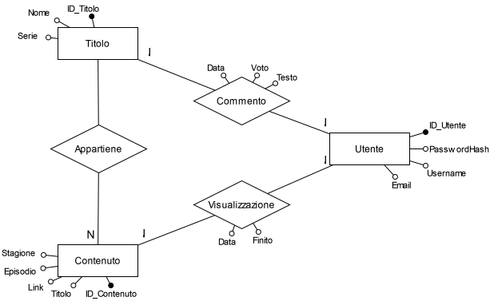

# Streaming

## Introduzione

Leggendo il testo della prova, che ci chiedeva di descrivere e analizzare un database per la gestione di una piattaforma streaming per poi sviluppare un sito web in MVC, abbiamo individuato 4 entità e 3 relazioni a cui abbiamo integrato i rispettivi attributi. L'entità <b> TITOLO </b> riguarda i film e le serie tv disponibili sulla piattaforma e contiene il <b> nome </b> del contenuto di tipo string e un attributo booleano <b> serie </b> che può assumere i valori 0 e 1: il primo significa che l'elemento considerato è un film mentre il secondo indica che è una serie tv. La chiave primaria di <b> TITOLO </b> è <b> ID_titolo </b> e questa entità ha due relazioni, una con <b> UTENTE </b> e una con <b> CONTENUTO </b>. Per quanto riguarda quella con <b> UTENTE </b>, abbiamo realizzato la relazione <b> Commento </b> di tipo <b> N a N </b> in quanto un utente può commentare più contenuti e anche quest'ultimi possono essere commentati da più utenti, considerando però che il commento di un utente è univoco, quindi può commentare una sola volta un determinato film o una determinata serie tv. <b> Commento </b> ha come attributi la <b> data </b> del commento di tipo date, il <b> voto </b> che viene dato dopo la visualizzazione e il <b> testo </b> del commento di tipo string. La relazione <b> UTENTE </b> ha come chiave primaria <b> ID_utente </b> e contiene lo <b> username </b>, la <b> passwordHash </b> e l'<b> email </b> di tipo string. La seconda relazione di <b> TITOLO </b> con <b> CONTENUTO </b> è di tipo <b> 1 a N </b> in quanto ad ogni cortometraggio appartengono uno o più contenuti, intesi come stagioni ed episodi, mentre questi contenuti sono univoci per ogni cortometraggio. Ad esempio mentre per una serie tv ci possono essere diverse stagioni con altrettanti episodi, un film ha una sola stagione e un unico episodio. La chiave primaria di <b> CONTENUTO </b> è <b> ID_contenuto </b> e gli attributi ad esso correlati sono <b> stagione </b> ed <b> episodio </b>di tipo int mentre <b> titolo </b> e <b> link </b> sono di tipo string. L'ultima relazione collega <b> CONTENUTO </b> con <b> UTENTE </b>. Il nome della relazione è <b> Visualizzazione </b> ed è di tipo <b> N a N </b> in quanto un utente può visualizzare più contenuti e un contenuto può essere visualizzato da più utenti. <b> Visualizzazione </b> ha come attributi la <b> data </b> di visualizzazione di tipo date e l'attributo booleano <b> finito </b> che specifica se la visualizzazione di un contenuto è terminata o meno.
## Schema ER

## Schema Logico

- Titolo: <u>ID_Titolo (PK)</u>, Nome, Serie;

- Utente: <u>ID_Utente (PK)</u>, PasswordHash, Username, Email;

- Contenuto: <u>ID_Contenuto (PK)</u>, Stagione, Episodio, Link, Titolo, , <u>ID_Titolo (FK)</u>;
  
- Visualizzazione: Data, Finito, <u>ID_Utente (PK)</u>, <u>ID_Contenuto (FK)</u>;
  
- Commento: Data, Testo, Voto, <u>ID_Utente (FK)</u>, <u>ID_Titolo (FK)</u>;

## Tabelle in DDL

CREATE TABLE Titolo

(

    ID_Titolo INT NOT NULL PRIMARY KEY IDENTITY,

    Nome VARCHAR(100) NOT NULL,

    Serie BOOLEAN NOT NULL
)

CREATE TABLE Contenuto

(

    ID_Contenuto INT NOT NULL PRIMARY KEY IDENTITY,

    Stagione INT NOT NULL,

    Episodio INT NOT NULL,

    Titolo VARCHAR(100) NOT NULL,

    Link VARCHAR(100) NOT NULL,

    ID_Titolo INT NOT NULL FOREIGN KEY REFERENCES Titolo(ID_Titolo)
)

CREATE TABLE Utente

(

    ID_Utente INT NOT NULL PRIMARY KEY IDENTITY,

    PasswordHash VARCHAR(100) NOT NULL,

    Username VARCHAR(100) NOT NULL,

    Email VARCHAR(100) NOT NULL,

)

